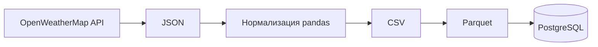
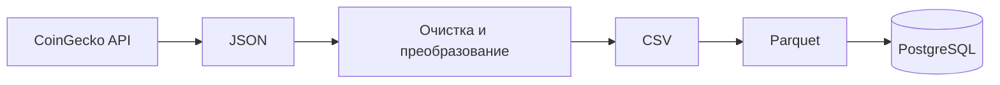

# Лабораторная работа №5 — ETL-пайплайны в Apache Airflow

В работе реализованы DAG-пайплайны, которые получают данные из внешних API, преобразуют их в несколько форматов и загружают в PostgreSQL. Отдельный тестовый DAG показывает последовательное выполнение Bash- и Python-задач.

## Пайплайны

### Погода — `weather_dag.py`

Пайплайн получает текущую погоду для Гурьевска из OpenWeatherMap и выполняет цепочку:



DAG `weather_data_pipeline_dag` запускается ежедневно в `21:00 UTC`, что соответствует полуночи по московскому времени. Создание таблицы PostgreSQL и получение данных начинаются параллельно, затем выполняются преобразование и экспорт.

### Криптовалюты — `crypto_dag.py`

Пайплайн получает цены Bitcoin и Ethereum в рублях через CoinGecko:



DAG `crypto_pipeline_dag` запускается каждые пять минут. Он удаляет служебное поле ошибки API, формирует табличный набор данных и сохраняет его в таблицу `crypto_data`.

### Тестовый DAG — `test_dag.py`

`my_test_dag` запускается вручную и последовательно выполняет две задачи: вывод приветствия через `BashOperator`, затем через `PythonOperator`.

## Технологии

- Python;
- Apache Airflow;
- PostgreSQL;
- pandas и PyArrow;
- Requests;
- OpenWeatherMap API;
- CoinGecko API;
- JSON, CSV и Apache Parquet.

## Настройка Airflow

Разместите файлы `weather_dag.py`, `crypto_dag.py` и `test_dag.py` в каталоге DAG вашего экземпляра Airflow. В окружении Airflow должны быть установлены `pandas`, `requests`, поддержка Parquet и PostgreSQL provider.

Создайте переменные Airflow:

| Ключ | Значение |
| --- | --- |
| `weather_key` | API-ключ OpenWeatherMap |
| `crypto_key` | API-ключ CoinGecko |

Создайте подключения Airflow:

| Connection ID | Назначение |
| --- | --- |
| `postgres_weather` | база PostgreSQL для таблицы `weather_data` |
| `crypto` | база PostgreSQL для таблицы `crypto_data` |

Переменные можно добавить через **Admin → Variables**, а подключения — через **Admin → Connections** в веб-интерфейсе Airflow.

## Результаты

После успешного выполнения DAG создаются файлы:

```text
Lab5/
├── weather_data.json
├── weather_data.csv
├── weather_data.parquet
├── crypto_price.json
├── crypto_price.csv
└── crypto_price.parquet
```

В репозитории уже находятся примеры результатов. Погодные данные включают координаты, температуру, давление, влажность, ветер, облачность и описание погоды; данные криптовалют содержат название актива, цену и валюту цены.

Файлы создаются по относительным путям. Рабочий каталог задач Airflow должен быть доступен на запись и выбран так, чтобы последующие задачи видели результаты предыдущих. Для распределённого Airflow лучше заменить локальные файлы общим хранилищем.

## Структура DAG

```text
Lab5/
├── weather_dag.py     # погодный ETL-пайплайн
├── crypto_dag.py      # ETL-пайплайн цен криптовалют
├── test_dag.py        # минимальный пример DAG
├── weather_data.*     # примеры результатов погодного пайплайна
└── crypto_price.*     # примеры результатов криптовалютного пайплайна
```
